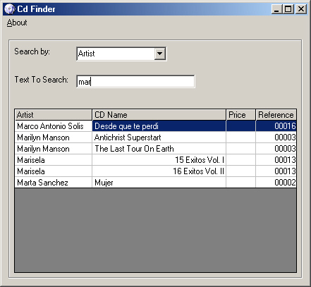



## Autocomplete with MsFlexGrid

### Description

Search data in a database depending of what you write in the textbox, if you press the "M" key in the textbox you will get all the data that begins with "M", VOTE FOR ME !!
 
### More Info
 

             |
---                |---
**Submitted On**   |2001-11-09 17:57:22
**By**             |[Daniel Contreras](https://github.com/Planet-Source-Code/PSCIndex/blob/master/ByAuthor/daniel-contreras.md)
**Level**          |Intermediate
**User Rating**    |4.6 (78 globes from 17 users)
**Compatibility**  |VB 6\.0
**Category**       |[Databases/ Data Access/ DAO/ ADO](https://github.com/Planet-Source-Code/PSCIndex/blob/master/ByCategory/databases-data-access-dao-ado__1-6.md)
**World**          |[Visual Basic](https://github.com/Planet-Source-Code/PSCIndex/blob/master/ByWorld/visual-basic.md)
**Archive File**   |[Autocomple343151192001\.zip](https://github.com/Planet-Source-Code/daniel-contreras-autocomplete-with-msflexgrid__1-28757/archive/master.zip)

